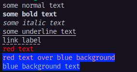
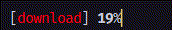
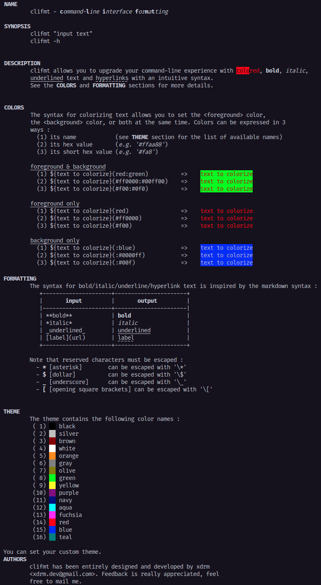

# | extended terminal format |

[](https://golang.org/doc/go1.20)
[](https://goreportcard.com/report/github.com/xdrm-io/clifmt)
[](https://godoc.org/github.com/xdrm-io/clifmt)
[](https://github.com/xdrm-io/clifmt/actions/workflows/go.yml)


Simple utility written in `go` that extends the standard `fmt.Sprintf` and `fmt.Printf` functions. It allows you to set foreground/background color, **bold**, <u>underlined</u>, _italic_ text and [hyperlinks](some-url).

<!-- toc -->

- [| extended terminal format |](#-extended-terminal-format-)
	- [I. How to use](#i-how-to-use)
		- [1) Requirements](#1-requirements)
		- [2) Installation](#2-installation)
		- [3) Usage](#3-usage)
			- [a) As a library](#a-as-a-library)
			- [b) As an executable](#b-as-an-executable)
	- [II. Format syntax](#ii-format-syntax)
		- [1) Text style](#1-text-style)
	- [III. Animations](#iii-animations)
	- [IV. Screenshots](#iv-screenshots)
	- [V. Incoming features](#v-incoming-features)

<!-- tocstop -->

----
## I. How to use

### 1) Requirements

The package **clifmt** can be used as a `go` library or as an executable. In either case, you need :

- any recent linux system (_has not been tested over other OSes_)
- `go` installed (_has not been tested under version **1.11**_)


### 2) Installation

Simply launch the following command in your favorite terminal

```bash
$ go get -u github.com/xdrm-io/clifmt
```

> It will download the project sources into _`$GOPATH`/src/github.com/xdrm-io/clifmt_.


### 3) Usage

#### a) As a library

You must import the library into your program with

```go
import "github.com/xdrm-io/clifmt"
```


Then, the following methods will be available

```go
// Printf wraps the standard fmt.Printf() features but adds formatting capabilities
func Printf(fmt string, args ...interface{}) error
```

```go
// Sprintf acts as 'Printf' but returns the string instead of printing it
func Sprintf(fmt string, args ...interface{}) (string, error)
```

```go
// Printpf acts as 'Printf' but takes as arguments either standard fmt.Printf arguments, or channels that will update the output when provided with correct values.
func Printpf(fmt string, args ...interface{}) (error)
```


#### b) As an executable

You must run from your terminal

```bash
$ go get -u github.com/xdrm-io/clifmt/cmd/clifmt
```
The  `clifmt` executable will be available in your $GOBIN directory.

> WARNING: The executable tool is a Work In Progress, it is not stable for now. You can use `clifmt --help` anyway to see details on the format, coloring, etc.


----

## II. Format syntax


### 1) Text style


The format has been designed with the markdown syntax in mind, but has some differences due to implementation issues and for stability.


The format is better described by the sample below than explanations :

```go
// markdown-like
Printf("some normal text")
Printf("**some bold text**")
Printf("*some italic text*")
Printf("_some underline text_")
Printf("[link label](http://link_url)")

// colors
Printf("${red text}(red)")
Printf("${red text over blue background}(red:blue)")
Printf("${blue background text}(:blue)")
```

The code below will print the following result :



> Any syntax feature (_e.g. bold, color, hyperlink, ..._) can be included in any other. In the same way any syntax feature can be interlaced (_e.g. "startA startB stopA stopB"_) with each other.

> Note that there can be some issues with interlaced hyperlinks as it is supported as other syntax features. But it works perfectly when used alone.

> Color names (_e.g. **red**, **blue**_) can be replaced by their hexadecimal representation (_e.g. **#ff0000**, **#0000ff**_) or the short version (_e.g. **#f00**, **#00f**_).

----

## III. Animations

The **Printpf**  method allows you to pass [channels](https://tour.golang.org/concurrency/2) among ordinary arguments. It allows you to animate the text you want to print each time you send data on a channel argument.


The example below shows a simple progress bar using markdown-like syntax, colors and animations :

```go
package main

import (
	"github.com/xdrm-io/clifmt"
	"time"
)

func main() {
    // animated values
	var (
		status   = make(chan interface{})
		color    = make(chan interface{})
		progress = make(chan interface{})
	)

    // print your animated values
	go clifmt.Printpf("[${%s}(%s)] **%d**%%", status, color, progress)

    // animate values
	status <- "download"
	color <- "red"
	for i := 0; i < 100; i++ {
		progress <- i
		time.Sleep(time.Millisecond * 200)
	}
	progress <- 100
	status <- "done"
	color <- "green"
}
```

The result is the following :




----

## IV. Screenshots

The -h flag returns a good example of what is possible.




----

## V. Incoming features

- [x] **markdown-like formatting** - bold, italic, underlined, (strike-through?)
- [ ] **command-line executable** - align text from terminal
- [ ] **global alignment** - align text dynamically
- [x] **progress-line** - redrawing format to show, for instance an animated progress bar on the same line

